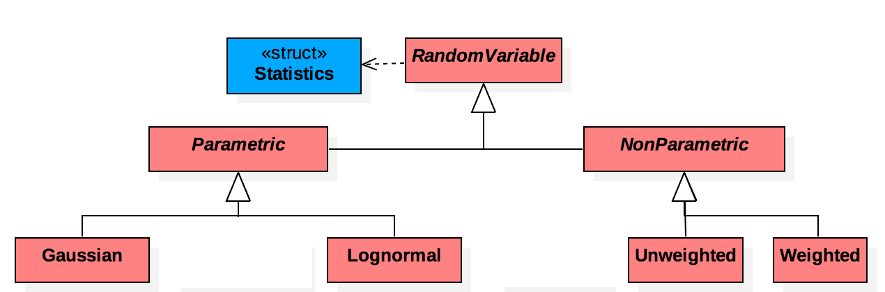

# RandomVariable

## Description
The RandomVariable Library is an C++ open source tool for representing statistical uncertainty in a precise, readable, and usable manner. Value uncertainty can be represented with a parametric distribution such as Gaussian or a nonparametric distribution such as a weighted sample set. To minimize loss of precision and accuracy, techniques such as Latin Hypercube sampling are used when converting a data set to a distribution and vice versa. Calculations may also be performed on multiple RandomVariable objects by sampling/overlaying techniques.

* **RandomVariable**:

  The RandomVariable class holds and represents the uncertainty data. It is the superclass of the two types of distributions and their respective subclasses. The Hierarchical structure allows for polymorphism and late binding on distribution objects.

* **Translation**:

  Translation is a namespace with functions handling Parametric and NonParametric types. By using an external namespace that can access the definitions of all Parametric and NonParametric distributions, we can decrease coupling between distribution objects and avoid circular dependencies. For instance, if a developer wanted to call a sampling function on a Gaussian distribution and receive and unweighted sample object, the Gaussian object would have to know the definition of an unweighted sample object whereas with Translation, the namespace can provide information about other classes and free distributions of that burden

* **Statistics**:

  Statistics is a small struct that allows the packaging of information that we can use to instantiate a distribution or detail a distribution in common terms (parameters for each distribution will have different meaning, but the Statistics struct will be "universal")
  
* **[UNDER CONSTRUCTION] RandomVariableContainer**:

  The RandomVariableContainer object is a container for RandomVariable objects which allows the user to perform calculations on multiple RandomVariable objects. By passing a function pointer and the correct amount of RandomVariable object pointers.

## Structure

  The abstract RandomVariable class is inherited by the Parametric and NonParametric classes (also abstract). Each distribution type is inherited by named distributions (Lognormal, Exponential, etc.) and data set representations (Weighted, Unweighted, etc.). The statistics struct is used by the RandomVariable object (and it's descendants). The Translation namespace uses the RandomVariable and it's derivatives.

## Using

### REQUIREMENTS
* Cmake (https://cmake.org)
* Compiler capable of building C++11

### BUILD
To start build properly enter RandomVariableProject directory then change into the build directory.

```
$ cd RandomVariable Project
$ cd build
```

execute cmake and specify path to source as one directory higher

`$ cmake ..`

If cmake is not able to locate your gcc/g++ compiler, you can use the command

`$ cmake -D CMAKE_C_COMPILER=[location of gcc] -D CMAKE_CXX_COMPILER=[location of gcc] ..`

Next run make from the build directory or make -C build from RandomVariableProject.

### USE
Random Variable Library is built into a library in the lib directory. This library can then be linked with other software products to be used.

## Examples
There are a number of examples in the Examples directory.

## Semantics
* INCLUDES
Includes are placed in each file dependent on them, unless an included file already contains the necessary information.
If a library was included in two subclasses of a superclass, that include was not moved to the superclass to reduce the number of includes so an unnecessary include is avoided if the superclass were to be included on a different project.
* SYNTAX
Accessor function names follow the protocol:
Access entails a calculation - solely the name of the attribute
  Examples: mean()
Access does not entail calculation - ‘get’ + name of attribute
  Example: getMu()
* EXCEPTIONS:
std::invalid_argument instances are thrown in functions with input range limits (due to user input) such as:
pdf(), cdf(), caldIcdf(), setSigma(), etc.
These exceptions are not caught in the function, but are left to be caught by users calling these functions directly. If another function is calling a function containing a possible throw statement, it will contain a try/catch block.

## Applications
Uncertainty representation can be used in an almost infinite number of fields from applied mathematics to telecommunications. Most notably it can be utilized when handling data from entities susceptible to inaccuracies such as machinery, telemetry, manual calculation. A primary application is the monitoring system for a fuel cell or structural component prognostics.

## Contact
If you have questions, please open an issue on github

## Contributing
All contributions are welcome! If you are having problems with the plugin, please open an issue on GitHub. If you would like to contribute directly, please feel free to open a pull request against the "dev" branch. Pull requests will be evaluated and integrated into the next official release.

## Next Steps
Software developers expanding this library should improve the coupling between a select few distribution classes. Some shortcuts were taken where privacy and was not a concern and checking was unnecessary. If future contributors aim to make the software more secure and abstracted, they should decrease further direct access to the underlying data structure (overload index operator) and class private variables. Adding more distributions and data set representations should be trivial if they follow a similar format as the current objects. The process for setting up a calculation involving multiple RandomVariables could be make simpler.

## Notices

Copyright ©2017 United States Government as represented by the Administrator of the National Aeronautics and Space Administration. All Rights Reserved.

No Warranty: THE SUBJECT SOFTWARE IS PROVIDED "AS IS" WITHOUT ANY WARRANTY OF
ANY KIND, EITHER EXPRESSED, IMPLIED, OR STATUTORY, INCLUDING, BUT NOT LIMITED
TO, ANY WARRANTY THAT THE SUBJECT SOFTWARE WILL CONFORM TO SPECIFICATIONS, ANY
IMPLIED WARRANTIES OF MERCHANTABILITY, FITNESS FOR A PARTICULAR PURPOSE, OR
FREEDOM FROM INFRINGEMENT, ANY WARRANTY THAT THE SUBJECT SOFTWARE WILL BE ERROR
FREE, OR ANY WARRANTY THAT DOCUMENTATION, IF PROVIDED, WILL CONFORM TO THE
SUBJECT SOFTWARE. THIS AGREEMENT DOES NOT, IN ANY MANNER, CONSTITUTE AN
ENDORSEMENT BY GOVERNMENT AGENCY OR ANY PRIOR RECIPIENT OF ANY RESULTS,
RESULTING DESIGNS, HARDWARE, SOFTWARE PRODUCTS OR ANY OTHER APPLICATIONS
RESULTING FROM USE OF THE SUBJECT SOFTWARE.  FURTHER, GOVERNMENT AGENCY
DISCLAIMS ALL WARRANTIES AND LIABILITIES REGARDING THIRD-PARTY SOFTWARE, IF
PRESENT IN THE ORIGINAL SOFTWARE, AND DISTRIBUTES IT "AS IS."

Waiver and Indemnity: RECIPIENT AGREES TO WAIVE ANY AND ALL CLAIMS AGAINST THE
UNITED STATES GOVERNMENT, ITS CONTRACTORS AND SUBCONTRACTORS, AS WELL AS ANY
PRIOR RECIPIENT.  IF RECIPIENT'S USE OF THE SUBJECT SOFTWARE RESULTS IN ANY
LIABILITIES, DEMANDS, DAMAGES, EXPENSES OR LOSSES ARISING FROM SUCH USE,
INCLUDING ANY DAMAGES FROM PRODUCTS BASED ON, OR RESULTING FROM, RECIPIENT'S USE
OF THE SUBJECT SOFTWARE, RECIPIENT SHALL INDEMNIFY AND HOLD HARMLESS THE UNITED
STATES GOVERNMENT, ITS CONTRACTORS AND SUBCONTRACTORS, AS WELL AS ANY PRIOR
RECIPIENT, TO THE EXTENT PERMITTED BY LAW.  RECIPIENT'S SOLE REMEDY FOR ANY SUCH
MATTER SHALL BE THE IMMEDIATE, UNILATERAL TERMINATION OF THIS AGREEMENT.
